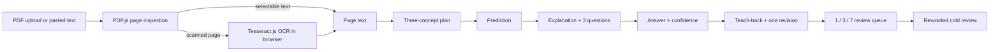

# Sparring architecture and contracts

## Product contract

The learner's uploaded PDF or pasted text is the only source. Sparring does not expose a
general chat box or a web-search tool. The active concept is taught and tested before the
app advances.

## Request flow



The public Render service is the official live application. It serves the static
interface and same-origin FastAPI endpoints, while all OpenAI calls remain on the server.
The GitHub Pages root redirects to Render. Only the explicit `?staticDemo=1` Pages URL
uses deterministic browser fixtures, vendored PDF.js, and a lazy vendored Tesseract.js
OCR fallback. In that fallback, PDF bytes, rendered pages, extracted text, and practice
generation stay on the device. The real-model path never silently falls back to fixtures.

## Structured output contracts

- `StudyPlan`: one observable target and exactly three unique concepts.
- `LessonOutput`: concise explanation; definition, mechanism, and application questions;
  one teach-back prompt.
- `QuizItem`: four options, a bounded answer index, one rationale and misconception tag
  per option, and a verbatim source anchor.
- `TeachbackOutput`: linked/listed heuristic, covered points, missing points, one feedback
  statement, and an optional repair sentence stem.
- `ColdQuiz`: exactly three variants that preserve item type and source anchor.

Pydantic forbids extra model fields. Cold-review variants are rejected if they keep the
same wording, change the item type, or change the source anchor.

## PDF contract

`POST /api/extract/pdf` accepts one multipart PDF:

- maximum 20 MB;
- maximum 80 pages;
- `%PDF-` magic header required;
- password-protected documents rejected;
- at least one complete sentence (40 readable characters);
- source markers use `[Page N]`;
- no upload bytes are written to disk.

If extracted text exceeds the 24,000-character learning-material cap, the API truncates
it and returns an explicit warning.

The explicit Pages fallback applies the same 20 MB, 80-page, page-marker, and
24,000-character limits in the browser. It first uses the PDF text layer. A page with
fewer than 20 selectable characters is rendered to a memory-bounded canvas and passed
to one reusable Tesseract.js worker with English and Simplified Chinese data. Pages are
processed sequentially, the UI shows progress and cancellation, and successful text is
kept when another page is unreadable.

PDF.js, Tesseract.js, the compatible WASM core variants, and language data are pinned
and served from the same origin. The browser chooses the compatible core lazily; no
third-party CDN receives the document or a rendered page. The first OCR run downloads
the local OCR runtime, after which browser caches can reuse it.

## State and evidence

The browser owns resumable learning state. The server owns only observation events:

```text
session_id, event_type, concept, score, confidence,
linked, review_stage, created_at
```

The evidence table intentionally has no recommendation, source material, PDF, or learner
answer columns.

Review items use ISO local dates and explicit states:

- `scheduled`
- `scheduled_reviews_complete`

The final state uses `dueAt: null`; it never relies on `Infinity`, which JSON would
silently convert to `null` without an explicit status.

## Failure behavior

| Failure | Learner-visible behavior |
| --- | --- |
| Missing API key | Honest configuration error; no fixture fallback |
| Model timeout | Retry the same saved step |
| Invalid structured output | Incomplete-step error; no partial model text shown |
| Unverified source anchor | Response rejected and retry offered |
| Password-protected PDF | Upload an unlocked copy; existing work remains |
| Unclear scanned page | Keep readable pages, identify skipped pages, and request a clearer scan |
| Long scanned PDF | Show page/OCR progress and provide an explicit cancel action |
| Offline during generated step | Draft retained; retry after connection |
| Evidence sync failure | Learning continues; event remains queued locally |
| Corrupt localStorage | Damaged state set aside; safe fresh session opens |

## Accessibility intent

- semantic headings, regions, forms, fieldsets, legends, and native radios;
- explicit answer and confidence choices with no confidence default;
- visible focus, skip link, title updates, and post-render focus management;
- non-color-only correct/incorrect labels;
- polite status and assertive error announcements;
- reduced-motion and forced-colors handling;
- responsive reflow at tablet and phone widths.

This is WCAG 2.2 AA intent and engineering verification, not a third-party compliance
certification.
